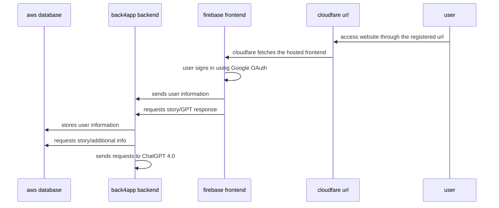

# Detectaive
# Public URL
[https://www.detectaive.com/](https://www.detectaive.com/)

# Video Presentation
[https://youtu.be/PBPeaCT99FU](https://youtu.be/PBPeaCT99FU)

# Architecture Chart




# setup:
Note: While the end user will access everything front to back (i.e. url->frontend->backend->database), it is recommended to do the setup back to front (database->backend->frontend->url) as each step requires information from the previous one.


### Frontend vue project
## Project setup
```
npm install
```

## Compiles and hot-reloads for development
```
npm run serve
```

## Compiles and minifies for production
```
npm run build
```

## Lints and fixes files
```
npm run lint
```

### Hosting
Navigate to [Firebase](https://firebase.google.com/) to create an account and a project. Next, download and set up CLI. Once you are done, type
```
firebase init hosting
```
and follow the instructions listed there. You will be asked to choose a project, directory and configuration. After that is done, all that is left is to drag built frontend from dist folder frpm your vue project into public folder of your firebase directory and type
```
firebase deploy
```

## AWS
use with
```
run on command line: mysql -h [endpoints] -u [username] -p
```

### Backend
```
python app.py
```

