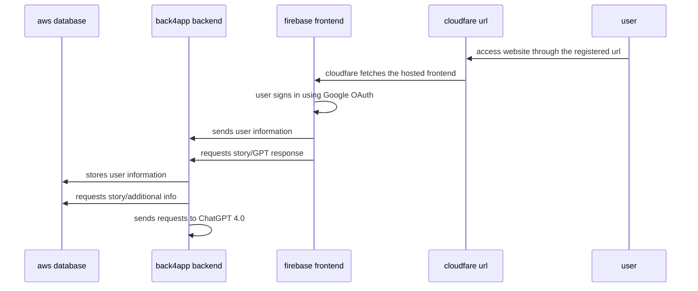

# detectaive




# setup:
Note: While the end user will access everything front to back (i.e. url->frontend->backend->database), it is recommended to do the setup back to front (database->backend->frontend->url) as each step requires information from the previous one.

## Cloudfare (optional)
### Create account
Head to [Cloudfare](https://www.cloudflare.com/ ) and create an account


### Search for and purchase domain
Once you have an account, navigate to 'Domain Registeration' to purchase your domain


### Add firebase-provided ip to Type A and Type TXT DNS Records
Once you have a domain, go into domain management and into DNS records. In firebase, navigate to the Hosting page and click 'add a custom domain.' Then add both a TYPE A and TYPE TXT DNS record in cloudfare using the information provided by Firebase hosting.


### Optional: Set up CNAME record for subdomains (like www.)
This will allow you to access the website using www. so instead of just detectaive.com, users will also be able to use www.detectaive.com

## Firebase
### Create account and project
Navigate to [Firebase](https://firebase.google.com/) to create an account and a project. 


### Set up CLI
Next, download and set up [CLI](https://firebase.google.com/docs/cli#install_the_firebase_cli). Make sure to follow the appropriate instructions for your operating system. Once you are done, type
```
firebase init hosting
```
and follow the instructions listed there. You will be asked to choose a project, directory and configuration. After that is done, all that is left is to drag the built frontend from dist folder from your vue project into the public folder of your Firebase directory.


### Deploying project
Once that is done, type

```
firebase deploy
```
into the CLI. This should fully deploy your frontend code to Firebase.


### Optional: Setting up Google Authentication
Optionally, this is also where you can set up your google authentication, if you are using that.


If you do, you will need to replace the firebase api key with your own, it should look something like this:


(since the firebase API keys are only used to identify the project on the google servers, they are safe to expose to the public)

## Back4App
### Create account
Navigate to [Back4App](https://www.back4app.com/), create and account and a project.


### Fork the backend code on github
Back4app will try to host the code directly from a github repo which you need to own so you will need to fork a version of the backend.


### Create new backend container for that forked project
Make sure the Docker file is present then select the repo in project, Back4App should take care of the rest. To use the new backend in the frontend, you will need to replace the current backend url with the one provided by Back4App


### Setting up Enviornmental Variables
These help keep secrets (like API keys) hidden from the end user. You will need to go into settings then environment variables to enter your OPENAI_API_KEY, and database information like HOST, PORT, DATABASE, USER, and PASSWORD. You can either use these names or edit the Docker file.


(These API keys should be kept secure)

## AWS
- use with
    - run on command line: mysql -h [endpoints] -u [username] -p
    - connect to Emory Unplugged for ip address that are allowed to access
    - use 
        USE detectaive;
        SHOW TABLES;
        DESCRIBE table_name;
        etc to view and modify columns
